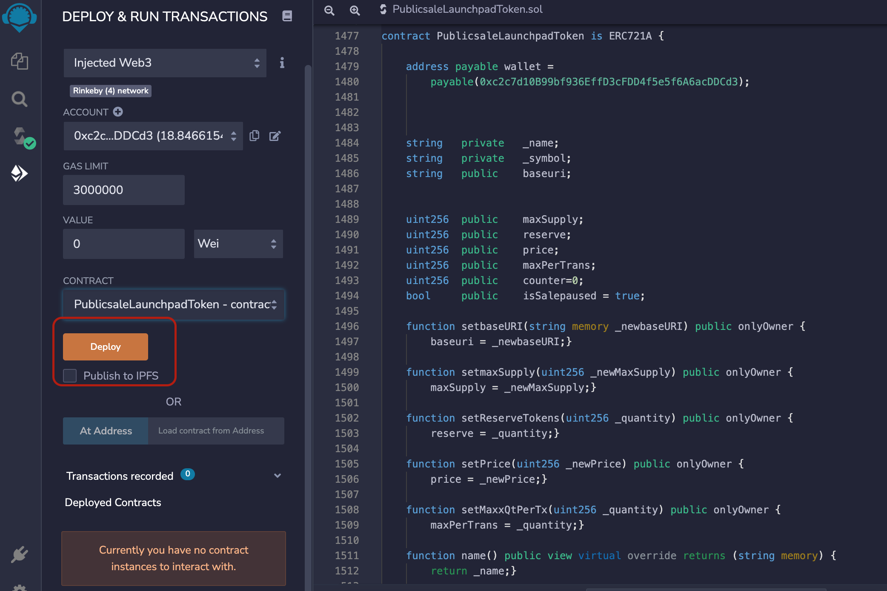
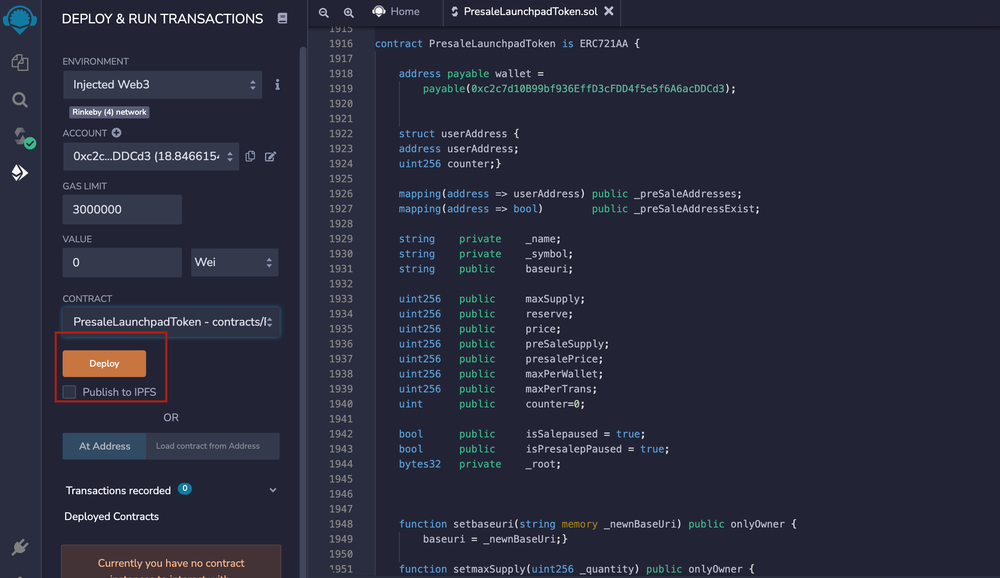
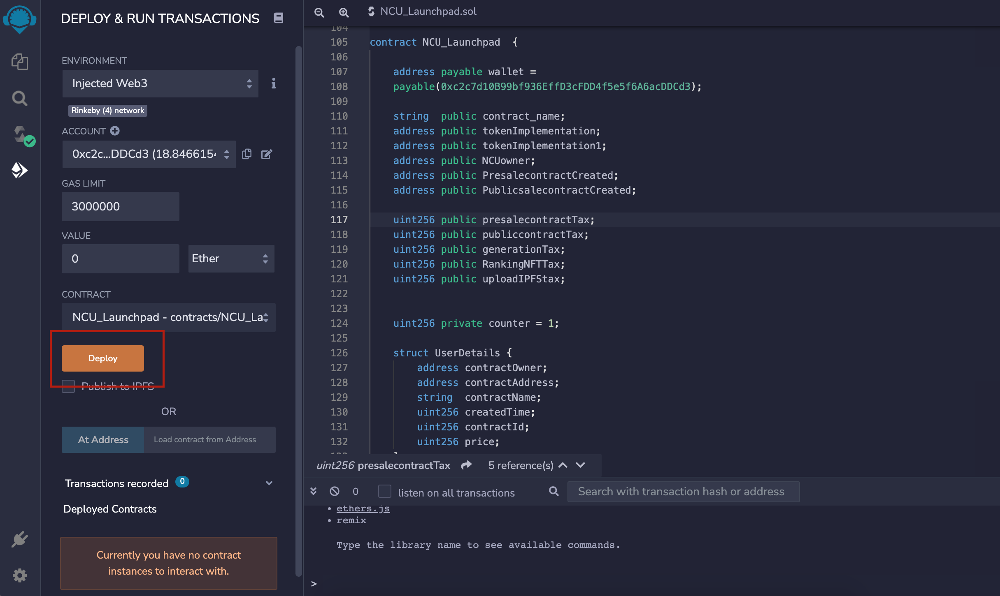

# What is NCU launchpad 
NCU launchpad is a factory contract made for those with zero knowledge of smart contracts and who want to launch their NFT collection
then this contract will be a key. Users with zero knowledge will have to pay a defined amount and this contract will make a new contract by itself.

## Functionality of NUC launchpad 

Pre-sale and public sale purposes are typically pre-determined. The preconfigured contract template is used to import them. The most recent client contract contains a finalized list of the contract's terms. The contract's presale and public sale functionalities are both available to the client.

## Features

- Presale functionality
- Public sale functionality

## Screenshots for depolyment
PublicSaleLaunchpadToken 

PresaleLaunchpadToken

NCU_Launchpad

## Main functions of launchpad contracts

## Functions

###  ClonePresale:

The criteria listed below are necessary for the payable function to operate. It can create contracts using both public and presale minting features.

| Parameter | Type     | Description                |
| :-------- | :------- | :------------------------- |
| `name` | `string` | name of contract |
| `symbol` | `string` | symbol of contract |
| `maxsupply` | `uint256` | The totalsupply of nfts |
| `presalesupply` | `uint256` | totalsupply of presale token |
| `maxpertrans` | `uint256` | maximum tranactions in one transaction |
| `reserve ` | `uint256` | reserve tokens for owner |
| `price` | `uint256` | price of tokens  |
| `presaleprice` | `uint256` | presale price of tokens |
| `baseuri` | `string` | location of metadata |
| `maxperwallet` | `uint256` | perwallet max limit |
| `root` | `byte32` | Merkle root for whitelisting  |
| `json` | `bool` | metadata has json extension or not  |

###  ClonePublic: 

It is a payable function that needs the following inputs in order to work. The operation of public minting is entirely its responsibility.

| Parameter | Type     | Description                       |
| :-------- | :------- | :-------------------------------- |
| `name`      | `string` | name of a contract |
| `symbol`      | `string` | symbol of contract |
| `maxsupply`      | `uint256` | totalsupply of nfts |
| `maxpertrans`      | `uint256` | maximum tranactions in one transaction |
| `reserve`      | `uint256` | reserve tokens for owner |
| `price`      | `uint256` | price of tokens  |
| `baseuri`      | `string` | location of metadata |

###  Payment: 

Through this feature, the payment for the presale and public sale is collected. Additionally, ether transfers from the user to the owner of the Launchpad's wallet are handled by this function.

| Parameter | Type     | Description                       |
| :-------- | :------- | :-------------------------------- |
| `ether`      | `uint256` | ether amount |
| `string`      | `string` | which type of payment user wants to |

###  SetPresaleContractTAX:

This function subtracts the tax from the user that is levied for cloning the presale contract to the user's actual contract. Only the owner is authorised to manipulate the tax.

| Parameter | Type     | Description                       |
| :-------- | :------- | :-------------------------------- |
| `price`      | `uint256` | ether amount |

###  SetPublicsaleContractTAX:

This function subtracts the tax from the user that is levied for cloning the public sale contract to the user's actual contract. Only the owner is authorised to manipulate the tax.

| Parameter | Type     | Description                       |
| :-------- | :------- | :-------------------------------- |
| `price`      | `uint256` | ether amount |

###  SetWallet:
Only the owner is authorised to call this function as it allows the owner to change the wallet address.

| Parameter | Type     | Description                       |
| :-------- | :------- | :-------------------------------- |
| `newwallet`      | `address` | new wallet which user wants to enter |

